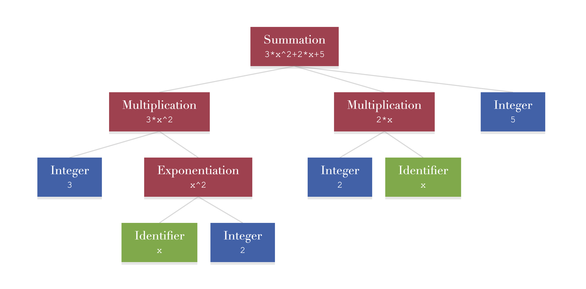
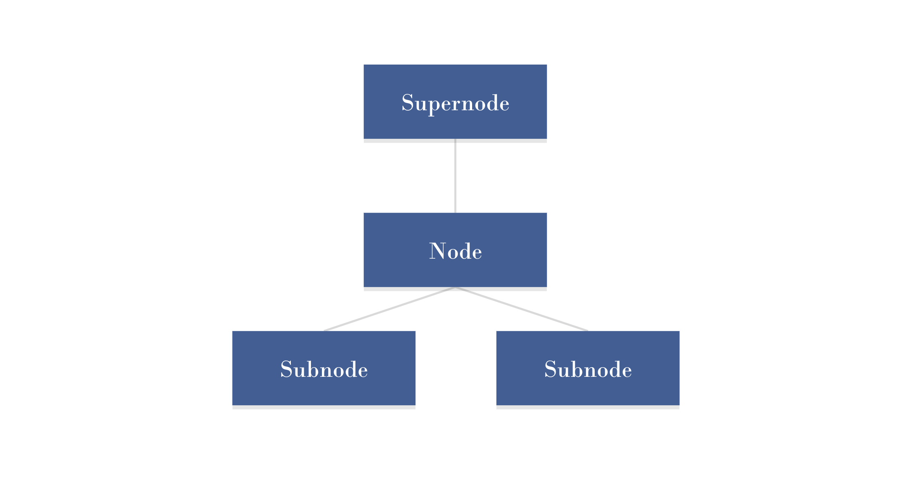

- [Expression Trees](#expression-trees)
  - [Terminology](#terminology)
  - [In the code](#in-the-code)
- [How does the parser work?](#how-does-the-parser-work)


## Expression Trees

If the parser is able to understand what a student has typed, then it produces an *expression tree* of what they have typed.

An expression tree is a *collection of linked nodes*. Each node represents an **operand** (like a variable or a number) or an **operation** (like addition or subtraction) or simply a **group of operands**.

For example, the image below shows an expression tree for 'a+b'.


The green nodes represent the identifiers *a* and *b*. 

*a* and *b* are operands in an *addition* operation, so they are subnodes of the red *addition* node.

Addition is a binary operation ('binary' meaning that it has two operands). Any other binary operation can be represented in the same way. The image below shows an expression tree for 'a*b'.


An operation can in itself be an operand of *another* operation, as shown in the following expression tree.


This expression tree shows the number 2 and the identifier *p* as operands of a *multiplication* operation, which is then the first operand of an *addition* operation. This expression tree is represented in plain text as '2*p+c'.

Notice how the expression tree retains information about the Order Of Operations (BODMAS). In the above expression tree, the 2 and the *p* are multiplied first, and the result of that operation is what becomes the first operand in the addition. This is essential for parsing mathematical notation.

Expression trees can be used to represent very complex expressions. The image below shows the expression tree for '3x^2+2x+5'



Lots of different things can be considered to be operations. Functions can be considered to be operations, where the parameters of the function are the operands.


Radicals can also be considered to be a type of operation.


In conclusion ...

- An expression tree is a collection of linked nodes.
- A node can represent an **operand** (like an identifier or a number).
- A node can represent an **operation** (like addition, subtraction, or a function or a radical, et c.).
- Or a node can simply represent a **group of operands** (no example has been shown above, but this will become important as we attempt to parse more unusual types of mathematical expressions.
- **Operation nodes can themselves be operands of other nodes.**

### Terminology

- For any given **node**, the nodes below it (which are usually its operands) are called its **subnodes**.
- For any given **node**, the node above it is called its **supernode**.
- A node can have any number of subnodes (including zero, as is the case for numbers and identifiers).
- A node can only have **one** supernode.
- The only node which doesn't have a supernode is the topmost node in the expression tree.



### In the code

Each node in the expression tree corresponds to an object.

The different types of node are represented by different classes.

Each node class ultimately inherits from a base class, called `RPNode`. Here is an example of the `RPNode` class:

```python
class RPNode(object):
    def __init__(self, nodeType):

        self.supernode = None
        self.depth = 0

        self.type = nodeType
        self.subtype = ""

        self.start = 0
        self.end = 0
        self._text = ""

        self._latex = ""
        self._asciiMath = ""

    @property
    def subnodes(self):
        return []

    @subnodes.setter
    def subnodes(self, value):
        pass
```

The `supernode` attribute is a reference to the node's supernode. This must be set for all nodes apart from the topmost node in the tree, for which it will remain as `None`.

The `depth` attribute represents the number of steps that must be taken to get back to the root node. Thus for the root node itself, this is 0; for subnodes of the root node, this is 1; for subnodes of subnodes of the root node, it's 2; et c.

The `type` and `subtype` attributes are strings representing what type the node is, and may be 'number', 'identifier', 'binaryOperation', 'unaryOperation', 'namedFunction', et c.

The subnodes of a node are not contained within a single `subnodes` attribute. Instead, they are accessed by a `subnodes` property; how the subnodes are stored is implemented differently by the different node classes, and the `subnodes` property can be overridden. On the base class `RPNode`, the `subnodes` property returns an empty list.

We can see how this works with one of the classes that inherits from `RPNode`.

```python
class RPFractionNode(RPNode):
    def __init__(self):
        super(RPNode, self).__init__("fraction")

        self.numerator = None
        self.denominator = None

    @RPNode.subnodes.getter
    def subnodes(self):
        return [self.numerator, self.denominator]

    @subnodes.getter
    def subnodes(self, value):
        self.numerator = value[0]
        self.denominator = value[1]
```

The `RPFractionNode` has attributes `numerator` and `denominator`, which are given as its subnodes.

More node type classes can be added to the package as needed.

## How does the parser work?

The parser is an object which, when given a string, returns an expression tree showing what mathematical expression the string represents.

If the parser cannot build the expression tree, then it should give information describing as best as possible what is wrong with the given string.

There are several qualities that a parser should ideally have:

- The parser will have to look at each character in the string at least once - ideally it will look at each character **only** once.
  - As we will see, there are times when it is convenient to break this rule (for the sake of making the code more readable), but for the most part following this rule makes the parser faster.
- The parser should be easy to extend.
- The design of the parser should be relatively easy to understand, so that someone who's not seen it before can quickly learn how to add new features to it.

The parser for this project uses a very simple design pattern that allows the parser to have these qualities.

The parser contains a set of functions that all have the same form:

```python
def parseX(inputText, marker):
```

Here 'X' is the type of thing we want to parse. This can be all sorts of things, at different scales - it may be a number, an identifier, a binary operation, a vector, a polynomial, et c..

The `inputText` argument is the input string that's given to the parser. Importantly, the entire input string is passed to any function that has this form.

The `marker` argument is an object that has a attribute `marker.position`, which is the position within the string at which to look for whatever 'X' is.

The most basic `parseX` function is the `parseWhiteSpace` function.

```python
def parseWhiteSpace(inputText, marker):
    t = "" # A temporary string to store any white space that's found

    # Start iterating over the input string from the given position.
    while (marker.position < len(inputText)):
        c = inputText[marker.position, marker.position + 1] # Get the character at the current position.
        
        if c in " \t\n":
            # If the character at the current position is a white space character (a space, a tab, or a new line character), then add it to the temporary string, and move the marker along by 1.
            t += c
            marker.position += 1
        else:
            # If the character at the current position is not a white space character, then exit the loop, as the current block of white space has ended.
            break

    if len(t) == 0:
        # If no white space was found, return nothing.
        return None

    # Otherwise, create a white space node, and return it.
    # Most likely this node will be discarded (as white space has no mathematical meaning), but it should be returned so that whichever function called parseWhiteSpace can decide what to do with it.
    node = RPWhiteSpaceNode()

    node.value = t

    return node
```