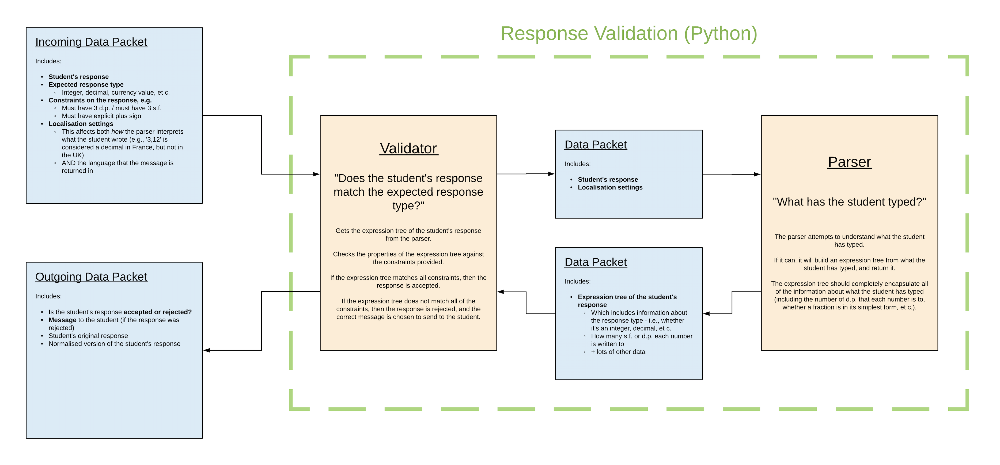
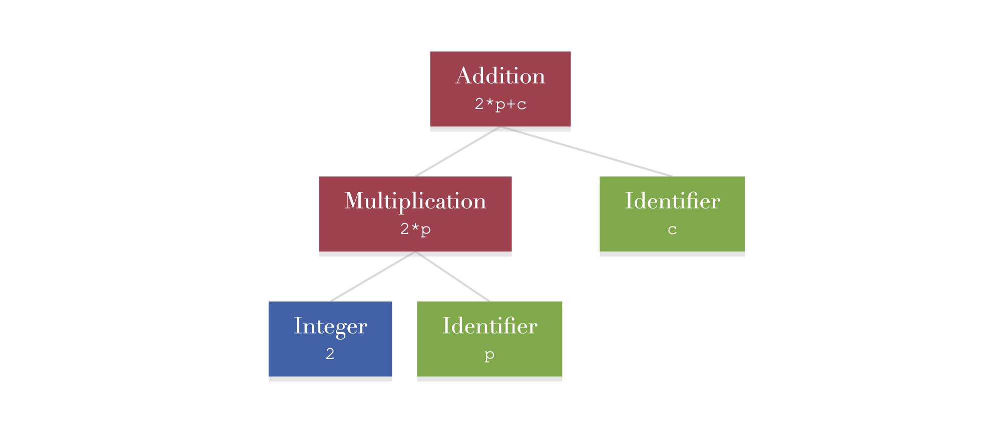
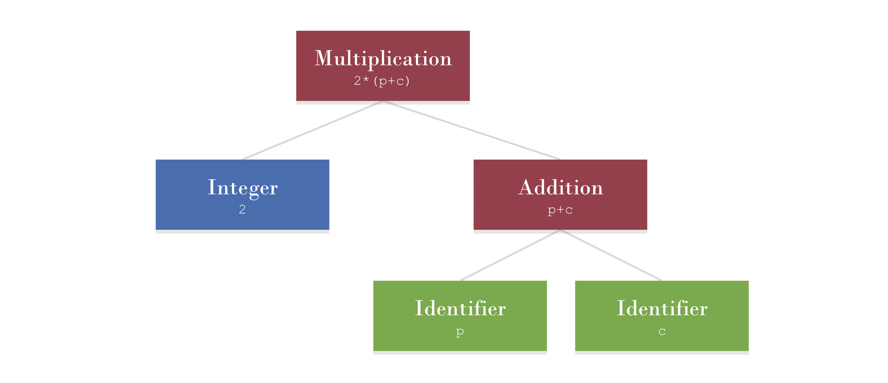

# Response Parsing Python

This document describes how the response parsing and validation system would work. It also describes some of the underlying concepts of the system, such as what expression trees are and how the parser works.

## Table of Contents

- [Response Parsing Python](#response-parsing-python)
  - [Table of Contents](#table-of-contents)
  - [An overview of the system](#an-overview-of-the-system)
    - [In the code](#in-the-code)
  - [Expression Trees](#expression-trees)
    - [Terminology](#terminology)
    - [In the code](#in-the-code-1)
  - [How does the parser work?](#how-does-the-parser-work)
  - [Unit Tests](#unit-tests)
  - [Features Roadmap](#features-roadmap)
    - [Version 1.0](#version-10)

## An overview of the system

The image below gives an overview of how the response parsing and validation system would work.

(Right Click + Open Image in New Tab to see a bigger version of the image.)



Each time a student answers a question, a packet of data is sent to the system.

This incoming packet of data includes:

- **The student's response** (as a `string`)
- **The expected response** type (as a `string`; one of `"integer"`, `"decimal"`, `"currencyValue"`, `"fraction"`, `"mixedNumber"`, `"complexNumber`", `"vector"`, et c.)
- **Constraints on the response**
  - This might be things like 'it must have 2 decimal places' or 'it must have an explicit plus sign' if it's a number, or things like 'it must be in ijk notation' if it's a vector
  - Given as a set of key-value pairs (the values may need to be objects)
- **Localisation settings**
  - This will affect how the parser will interpret the response
    - For example, if the locale is set to `France`, then '3,21' would be considered a decimal, but '3.21' would not; if the locale is set to `UK` then '3.21' would be considered a decimal, but '3,21' would not
    - It will also affect what language the message back to the student is given in

The system will take this packet of data, and parse the student's response (building an *expression tree* in the process ([see below](#expression-trees))). It will then compare the expression tree against the given constraints, and return a new packet of data.

This outgoing packet of data includes:

- Whether or not the response is **accepted** or **rejected**.
- The **message** to the student
  - If there are multiple messages that could be sent to the student, the validator will decide, based on the student's response, which ones should be sent.
  - If the response is **accepted**, this system will not provide a message
- The **student's original response**
- The **normalised version of the student's response**, which can be used for marking the answer
- (Optionally) the expression tree

### In the code

Below is an example of how the incoming data packet might look. (Here I've used JSON, but a different format could be used.)

```json
{
    "studentsResponse": " 2.3 ",
    "expectedResponseType": "decimal",
    "responseConstraints": {
        "mustHaveNDecimalPlaces": 2,
        "mustHaveExplicitPlus": false,
    },
    "localizationSettings": {
        "locale": "en-GB"
    }
}
```

Below is an example of how the outgoing data packet might look if the system were given the data packet above.

```json
{
    "isAccepted": false,
    "message": "Give your answer to two decimal places.",
    "studentsResponse": " 2.3 ",
    "normalizedResponse": "2.3"
}
```

Here is another example of the incoming and outgoing data packets, but with a more complicated answer type.

(Note that complex numbers will not be supported in version 1.0 - they will be included in a later version - I'm just using them here as an example.)

```json
{
    "studentsResponse": " 2 + 3i - 1 ",
    "expectedResponseType": "complexNumber",
    "responseConstraints": {
        "allowedForms": {
            "form": "cartesian",
            "mustHaveSingleRealTerm": true,
            "mustHaveSingleImaginaryTerm": true,
            "termsMustBeOrdered": true
        }
     },
    "localizationSettings": {
        "locale": "en-GB"
    }
}
```

In this case, the response will be rejected because it contains more than one real term, and is thus not in its simplest form.

```json
{
    "isAccepted": false,
    "message": "Give your answer in its simplest form.",
    "studentsResponse": " 2 + 3i - 1 ",
    "normalizedResponse": "2+3*i-1"
}
```

## Expression Trees

If the parser is able to understand what a student has typed, then it produces an *expression tree* of what they have typed, and sends it back to the validator. This section of the document explains what an expression tree is on a conceptual level, and then how expression trees can be implemented in Python code.

An expression tree is a way of representing a mathematical expression. An expression tree is a *collection of linked nodes*. Each node represents an **operand** (like a variable or a number) or an **operation** (like addition or subtraction) or simply a **group of operands**.

For example, the image below shows an expression tree for 'a+b'.


The green nodes represent the identifiers *a* and *b*. 

*a* and *b* are operands in an *addition* operation, so they are subnodes of the red *addition* node.

Addition is a binary operation ('binary' meaning that it has two operands). Any other binary operation can be represented in the same way. The image below shows an expression tree for 'a*b'.


An operation can in itself be an operand of *another* operation, as shown in the following expression tree.



This expression tree shows the number 2 and the identifier *p* as operands of a *multiplication* operation, which is then the first operand of an *addition* operation. This expression tree is represented in plain text as '2*p+c'.

Notice how the expression tree retains information about the Order Of Operations (BODMAS). In the above expression tree, the 2 and the *p* are multiplied first, and the result of that operation is what becomes the first operand in the addition. The order of operations is described by the shape of the tree - the tree would have a different shape if the addition were done first, for example:



Expression trees can be used to represent very complex expressions. The image below shows the expression tree for '3x^2+2x+5'


Lots of different things can be considered to be operations. Functions can be considered to be operations, where the parameters of the function are the operands.


Radicals can also be considered to be a type of operation.


In conclusion ...

- An expression tree is a collection of linked nodes.
- A node can represent an **operand** (like an identifier or a number).
- A node can represent an **operation** (like addition, subtraction, or a function or a radical, et c.).
- Or a node can simply represent a **group of operands** (no example has been shown above, but this will become important as we attempt to parse more unusual types of mathematical expressions.
- **Operation nodes can themselves be operands of other nodes.**

### Terminology

- For any given **node**, the nodes below it (which are usually its operands) are called its **subnodes**.
- For any given **node**, the node above it is called its **supernode**.
- A node can have any number of subnodes (including zero, as is the case for numbers and identifiers).
- A node can only have **one** supernode.
- The only node which doesn't have a supernode is the topmost node in the expression tree.


### In the code

Each node in the expression tree corresponds to an object.

The different types of node are represented by different classes.

Each node class ultimately inherits from a base class, called `RPNode`. Here is an example of the `RPNode` class:

```python
class RPNode(object):
    def __init__(self, nodeType):

        self.supernode = None
        self.depth = 0

        self.type = nodeType
        self.subtype = ""

        self.start = 0
        self.end = 0
        self._text = ""

        self._latex = ""
        self._asciiMath = ""

    @property
    def subnodes(self):
        return []

    @subnodes.setter
    def subnodes(self, value):
        pass
```

The `supernode` attribute is a reference to the node's supernode. This must be set for all nodes apart from the topmost node in the tree, for which it will remain as `None`.

The `depth` attribute represents the number of steps that must be taken to get back to the root node. Thus for the root node itself, this is 0; for subnodes of the root node, this is 1; for subnodes of subnodes of the root node, it's 2; et c.

The `type` and `subtype` attributes are strings representing what type the node is, and may be 'number', 'identifier', 'binaryOperation', 'unaryOperation', 'namedFunction', et c.

The subnodes of a node are not contained within a single `subnodes` attribute. Instead, they are accessed by a `subnodes` property; how the subnodes are stored is implemented differently by the different node classes, and the `subnodes` property can be overridden. On the base class `RPNode`, the `subnodes` property returns an empty list.

We can see how this works with one of the classes that inherits from `RPNode`.

```python
class RPFractionNode(RPNode):
    def __init__(self):
        super(RPNode, self).__init__("fraction")

        self.numerator = None
        self.denominator = None

    @RPNode.subnodes.getter
    def subnodes(self):
        return [self.numerator, self.denominator]

    @subnodes.getter
    def subnodes(self, value):
        self.numerator = value[0]
        self.denominator = value[1]
```

The `RPFractionNode` has attributes `numerator` and `denominator`, which are given as its subnodes.

More node type classes can be added to the package as needed.

## How does the parser work?

This section of the document explains the design pattern used to make the parser - this section is mostly about how to implement the design pattern in code.

The parser is an object which, when given a string, returns an expression tree showing what mathematical expression the string represents.

If the parser cannot build the expression tree, then it should give information describing as best as possible what is wrong with the given string.

There are several qualities that this parser should ideally have:

- The parser will have to look at each character in the string at least once - ideally it will look at each character **only** once.
  - As we will see, there are times when it is convenient to break this rule (for the sake of making the code more readable), but for the most part following this rule makes the parser faster.
- The parser should be easy to extend.
- The design of the parser should be relatively easy to understand, so that someone who's not seen it before can quickly learn how to add new features to it.

The parser for this project uses a very simple design pattern that allows it to have these qualities.

The parser contains a set of functions that all have the same form:

```python
def parseX(inputText, marker):
```

Here 'X' is the type of thing we want to parse. This can be all sorts of things, at different scales - it may be a number, an identifier, a binary operation, a vector, a polynomial, et c..

The `inputText` argument is the input string that's given to the parser. Importantly, the entire input string is passed to any function that has this form.

The `marker` argument is an object that has a attribute `marker.position`, which is the position within the string at which to look for whatever 'X' is.

The most basic `parseX` function is the `parseWhiteSpace` function.

```python
def parseWhiteSpace(inputText, marker):
    t = "" # A temporary string to store any white space that's found

    # Start iterating over the input string from the given position.
    while (marker.position < len(inputText)):
        c = inputText[marker.position, marker.position + 1] # Get the character at the current position.
        
        if c in " \t\n":
            # If the character at the current position is a white space character (a space, a tab, or a new line character), then add it to the temporary string, and move the marker along by 1.
            t += c
            marker.position += 1
        else:
            # If the character at the current position is not a white space character, then exit the loop, as the current block of white space has ended.
            break

    if len(t) == 0:
        # If no white space was found, return nothing.
        return None

    # Otherwise, create a white space node, and return it.
    # Most likely this node will be discarded (as white space has no mathematical meaning), but it should be returned so that whichever function called parseWhiteSpace can decide what to do with it.
    node = RPWhiteSpaceNode()

    node.value = t

    return node
```

So this function looks for any white space characters at the position `marker.position`. If it finds any, it will create an `RPWhiteSpaceNode`, put the white space into it, and return it. It will also move the marker position along so that whatever function is called *after* this one will try to parse whatever is *after* the white space.

If it doesn't find any white space, it will return nothing, and the marker position will not change (the parser will not move on to a different part of the string).

On its own, this function probably looks like overkill - it's just white space, after all. But the usefulness of this function form becomes more apparent when we try to parse longer and more complex expressions, as these functions can easily be chained together recursively.

For example, the following function can be used for parsing integers.

```python
def parseInteger(inputText, marker):
    t = "" # A temporary string to store any digits that are found

    # Start by grabbing any white space at the current position.
    whiteSpaceNode1 = parseWhiteSpace(inputText, marker)

    # Start iterating over the input string from the given position.
    while (marker.position < len(inputText)):
        c = inputText[marker.position, marker.position + 1] # Get the character at the current position.
        
        if c in "0123456789":
            # If the character at the current position is a numeric digit, then add it to the temporary string, and move the marker along by 1.
            t += c
            marker.position += 1
        else:
            # If the character at the current position is not a numeric digit, then exit the loop, as the current integer has ended.
            break

    # There may be white space after the number too.
    whiteSpaceNode2 = parseWhiteSpace(inputText, marker)

    if len(t) == 0:
        # If no digits were found, return nothing.
        return None

    # Otherwise, create an integer node, and return it.
    node = RPIntegerNode()

    node.value = t

    return node
```

The `parseInteger` function works in the same way as `parseWhiteSpace`, and because they have the same arguments `parseWhiteSpace` can be called from within `parseInteger`. This means that the `parseInteger` function can account for any white space before or after the integer, and discard it.

This function can parse each of the following, and return just the integer:

- '123'
- ' 123'
- '&nbsp;&nbsp;&nbsp;123'
- '123 '
- '123&nbsp;&nbsp;&nbsp;'
- '&nbsp;&nbsp;&nbsp;123&nbsp;&nbsp;&nbsp;'

The usefulness becomes even more apparent when we try to parse fractions.

```python
def parseFraction(inputText, marker):

    # First, get the numerator.
    # Because we built white space parsing into the parseInteger function, any white space that's around the integer will automatically be found and discarded.
    numerator = parseInteger(inputText, marker)

    if numerator == None:
        # If there's no numerator, then there's no fraction
        return None
    
    c = inputText[marker.position, marker.position + 1] # Get the character at the current position.

    if c == "/":
        # There must be a solidus at the current position, otherwise it's not a fraction
        marker.position += 1
    else:
        return None

    # Now get the denominator. Again, white space has already been dealt with.
    denominator = parseInteger(inputText, marker)

    if denominator == None:
        # If there's no denominator, then there's no fraction.
        return None

    # Otherwise, create a fraction node, and return it.
    node = RPFractionNode()

    node.numerator = numerator
    node.denominator = denominator

    return node
```

This `parseFraction` can parse all of the following, and return a fraction object, where the integer numerator and denominator have been captured:

- '1/2'
- ' 1 / 2 '
- '&nbsp;&nbsp;&nbsp;1&nbsp;&nbsp;&nbsp;/&nbsp;&nbsp;&nbsp;2&nbsp;&nbsp;&nbsp;'
- '&nbsp;&nbsp;&nbsp;345&nbsp;&nbsp;&nbsp;/&nbsp;&nbsp;&nbsp;678&nbsp;&nbsp;&nbsp;'

But all of the following will not be considered to be fractions:

- '1'
- '1/'
- '/2'
- '1//2'

We are able to parse the entire fraction by parsing smaller elements of the fraction - the numerator and the denominator. This allows us to reuse code. When parsing larger and more complex expressions, we can reuse the parsing functions that we used for smaller and simpler expressions.

It should be easy to see from here how this code can be extended to mixed numbers, ratios, percentages, decimals, currency values - all can have parsing functions built in the same way.

## Unit Tests

I cannot emphasise enough the extent to which the success of this system will depend on having a large and comprehensive set of unit tests.

A student can type a huge variety of different things into the answer box, and each one must have a very specific message / action. The only way to be sure that the system is working as intended, particularly as more features are added to it, is to have a large number of unit tests.

One of the advantages of having a single entry / exit point for data in the system (the incoming and outgoing data packets) is that it makes it very easy to create unit tests for.

## Features Roadmap

### Version 1.0

- Be able to parse and validate the following answer types
  - Integers (which includes all integers, both positive and negative)
  - Non-negative integers (all positive integers, as well as zero)
  - Decimals
  - Currency Values
- Follow design principles that make the system extensible to more answer types later
- Have a comprehensive set of unit tests for the above four answer types

